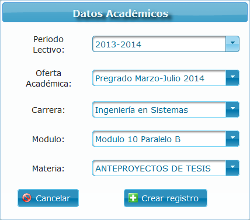
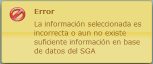
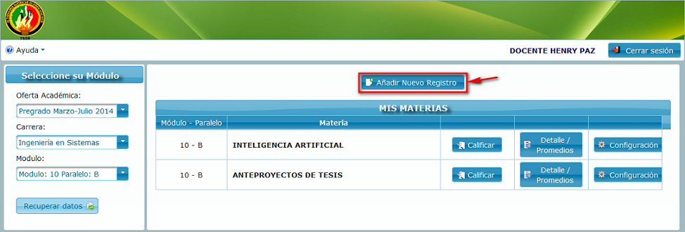

.. _addMatter-title:

***************
Añadir materias
***************

El sistema brinda la posibilidad al docente de recuperar información directamente de los registros del `SGA <http://docentes.unl.edu.ec/>`_ (Sistema de Gestión Académica) y así evitar el proceso manual que esto conllevaría. Entre la información que se recupera está el modulo con la lista de estudiantes y las materias que son impartida por dicho docente.

.. _addMatter-first:

Añadir materias por primera vez
===============================

En caso de ser la primera ocasión que se accede al sistema, será direccionado automáticamente al formulario de selección de información académica que se presenta en la siguiente imagen:

.. _addMatter-img-addMatter_form_select:

    **Formulario de selección de información académica**

Para obtener la información buscada se debe empezar de arriba hacia abajo. Los capos desplegados son:

	• **Periodo Lectivo.-** Hace referencia al periodo lectivo (periodo académico) al que pertenece la información que se desea recuperar. Por ejemplo periodo lectivo 2014 – 2015.

	• **Oferta Académica.-** Es básicamente el periodo que abarca el módulo de clases. Por lo general cada periodo académico consta de 2 ofertas académicas de cinco meses cada una.

	• **Carrera.-** Se refiere a la carrera en la cual el docente imparte clases. Se pude presentar el caso de que el docente enseñe en más de una carrera.

 	• **Módulo.-** El módulo al cual pertenecen los estudiantes. Cabe resaltar que se incluye el modulo y paralelo para evitar errores entre distintos paralelos.

	• **Materia.-** Finalmente la materia que imparte el docente. Toda esta información referente a los distintos parámetros seleccionados queda almacenada en base de datos por lo que este proceso únicamente se realiza una vez por cada materia nueva.

La información se recupera directamente del SGA por lo que en caso de no haber información actualizada con relación a materias o paralelos asignados al docente en el periodo actual, se puede presentar un error informando al usuario sobre el problema como se aprecia a continuación:

.. _addMatter-img-addMatter_error:

    **Error por falta de información en el SGA**

.. _addMatter-main-reg:

Añadir materias desde el registro principal
===========================================

Existe la posibilidad de añadir nuevas materias desde el registro principal, para lo cual selecciona la opción **Añadir nuevo registro** como se aprecia en la imagen

.. _addMatter-img-addMatter_btn_new_reg:

    **Opción para añadir una materia al registro principal**

.. note::
	Los campos a desplegar y las operaciones a realizar son los mismos descritos en :ref:`addMatter-first` por lo que se obviara esta parte.
