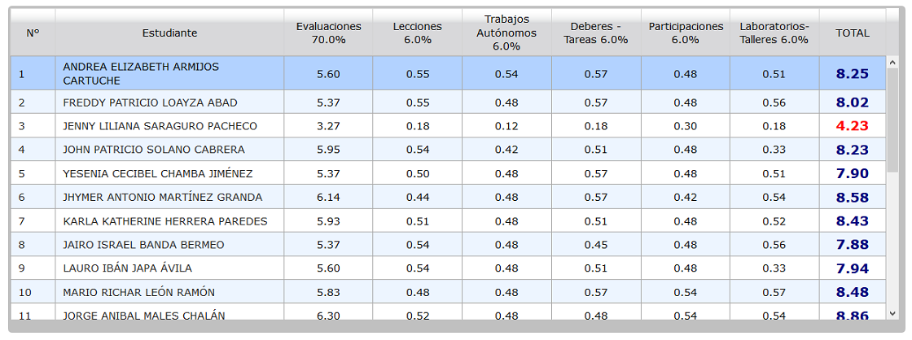
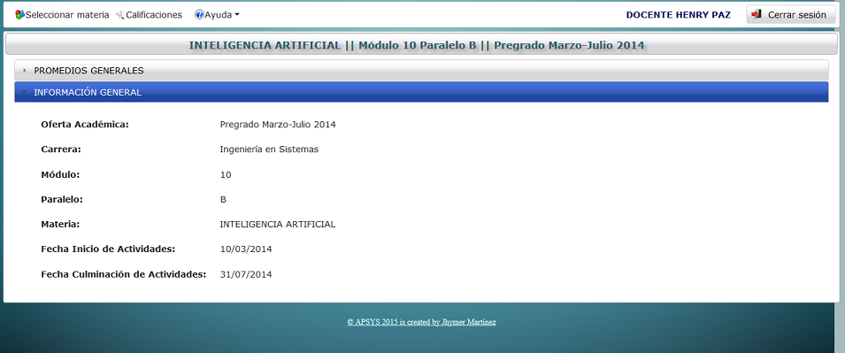

.. _optionAverage-title:

*************************
Promedio final y detalles
*************************

Como el título lo indica, esta opción tiene por finalidad la generación y presentación de promedios generales (finales) de los estudiantes en las distintas materias impartidas por el docente. A su vez se subdivide en dos apartados que se explican a continuación.

.. _optionAverage-general-average:

Promedios generales
===================

En esta opción se presentan los promedios generales de los estudiantes, para obtener este promedio se toma como base las calificaciones obtenidas en cada parámetro evaluable (evaluaciones, lecciones, deberes, etc.) y el peso configurado por el docente para cada uno (ver :ref:`optionConfiguration-title`) con lo que obtiene la tabla de promedios.

.. _optionAverage-img-optionAverage_general_average:

    **Promedios generales**

.. _optionAverage-general-information:

Información general
===================

En este apartado se presenta información sobre la oferta académica, carrera, modulo, paralelo, materia y las fecha de inicio y culminación de labores académicas para dicha oferta. Todos estos datos constituyen información valiosa para que el docente.

.. _optionAverage-img-optionAverage_general_inform:

    **Información general**

.. _optionAverage-reports:

Generación de reportes
======================

Existe la opción de generar reportes de las calificaciones finales de los estudiantes a fin de tener un respaldo físico. El formato del documento generado es pdf y basta con hacer clic en el icono ubicado en la parte superior de la tabla de calificaciones:

.. _optionAverage-img-optionAverage_option_pdf:

    **Botón para generar reporte**

Una vez hecho esto se descarga el documento al equipo estado listo para cualquier tipo de tarea necesaria.

.. _optionAverage-img-optionAverage_download:

.. figure:: ../../_static/OptionAverage/optionAverage_download.png 
    :align: center
    :alt: Descarga del documento
    :figclass: align-center

    **Descarga del documento**