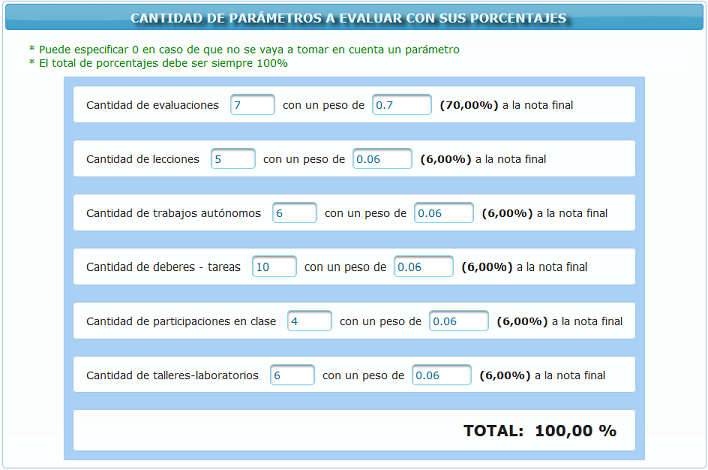

.. _optionConfiguration-title:

*************************
Configuraciones generales
*************************

En esta opción se realizan configuraciones relacionadas con el peso (porcentaje) y la cantidad de aportes que se estima se tomaran en cuenta durante el módulo de clases. 

En el caso de que no se vaya a tomar un parámetro en cuenta para la calificación del módulo, se debe especificar a **0 (cero)** tanto la cantidad como el peso y además se necesita realizar un ajuste del resto de parámetros para alcanzar el **100%** de la calificación.

.. note::
	Las evaluaciones son obligatorias por lo que se debe especificar como mínimo una evaluación.

.. _optionConfiguration-img-optionConfiguration_main:

    **Configuraciones generales**