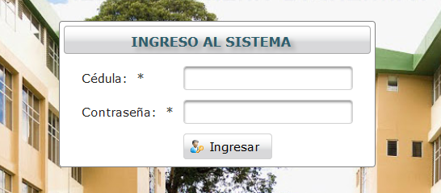
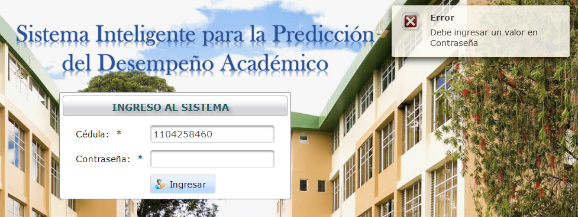

.. _systemAccess-title:

*****************
Acceso al sistema
*****************

.. _systemAccess-login:

Acceso Inicial
==============

Para ingresar al sistema el docente debe especificar su cédula y su contraseña en las casillas correspondiente como se aprecia en la imagen:

.. _systemAccess-img-sistemAccess_login:

    **Ingreso al Sistema**

.. note::
    La contraseña es la misma utilizada para el ingreso al Sistema de Gestión Académica (SGA)

En caso de proporcionar datos incorrectos se presentará un mensaje correspondiente

.. _systemAccess-img-sistemAccess_login_error:

    **Error de logueo**

Caso contrario el se presenta un mensaje de logueo exitoso

.. _systemAccess-img-sistemAccess_OK:

    **Ingreso correcto**

En caso de ser el primer ingreso al sistema, sera redirigido a la opción :ref:`addMatter-first` o en caso contrario a la vista :ref:`adminMatter-title`

